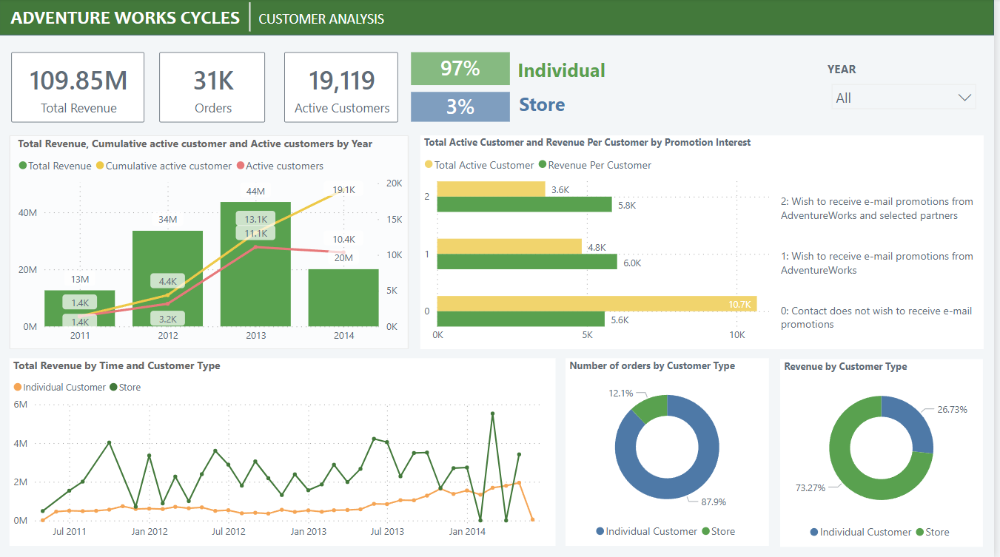
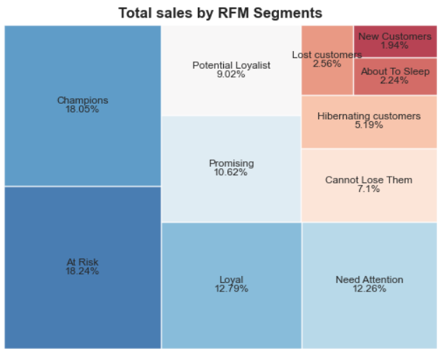
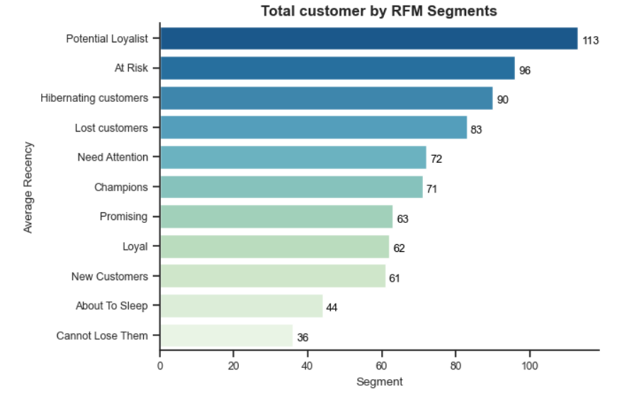

# Nga's Portfolio
# [Project 1: AdventureWorks Customer Segmentation Analysis](https://github.com/nqnga-0502/AventureWorks-CustomerSegmentation)
- The target of this project is to indentify the Customer segmentation and profiling and extract valuable information from raw data available in the databases
- Data was taken from the [AdventureWorks2019](https://learn.microsoft.com/en-us/sql/samples/adventureworks-install-configure?view=sql-server-ver16&tabs=ssms) public dataset
- Data processing and visualization with Power PI
  ## Result Overview
   

# [Project 2: SuperStore RFM Analysis](https://github.com/nqnga-0502/Superstore-RFM-Analysis)
- The main purpose of the project find out the customer's transaction attidutes with their purchase database result by applying RFM analysis. Based on the customer clustering result, marketing teams can conduct specific promotional campaign to different customer's clusters to retain more customers and maximize the store's profit.
- Data was taken from the fictional dataset which contains all the transactions that occurred between 2014 and 2017 for a UK-based and registered non-store online retail - SuperStore.
- Data processing and visualization with Python
  ## Result Overview
    
     

# [Project 3: Fraud transactions detection](https://github.com/nqnga-0502/Fraud-transactions-detection)
- The purpose of this project is to build a fraud detection system using machine learning models
- Data was taken from the public [data source](https://www.kaggle.com/datasets/dermisfit/fraud-transactions-dataset?select=fraudTrain.csv)

